# UAE Retail Intelligence Platform
## Entity Relationship Design

## 1. Purpose

This document defines the logical data model for the UAE Retail Intelligence Platform.

The database is organized into the following SQL Server schemas:

- core
- product
- customer
- sales
- inventory
- hr
- security
- analytics

The design supports:

- Multi-store UAE retail operations
- Customers and products
- Sales and payments
- Promotions
- Returns and refunds
- Inventory movements
- Store targets
- Authentication and authorization
- SQL Server Row-Level Security
- Analytics and forecasting


## 2. High-Level Business Flow

```text
Emirate
   ↓
City
   ↓
Store
   ↓
Order
   ↓
OrderItem
   ↓
Product

Customer
   ↓
Order

Product
   ↓
InventoryMovement

OrderItem
   ↓
ReturnItem
   ↓
Return

Store
   ↓
MonthlyTarget
```


# 3. Schemas

## core

Reference and organizational data.

Tables:

- Emirate
- City
- Store
- DateDimension
- SalesChannel
- PaymentMethod


## product

Product catalog and suppliers.

Tables:

- Category
- Subcategory
- Brand
- Supplier
- Product
- ProductSupplier


## customer

Customer master and segmentation data.

Tables:

- Customer
- CustomerSegmentHistory


## sales

Transactional and commercial data.

Tables:

- Promotion
- PromotionProduct
- PromotionCategory
- PromotionStore
- SalesOrder
- SalesOrderItem
- OrderPayment
- Return
- ReturnItem
- Refund
- StoreMonthlyTarget


## inventory

Inventory configuration and transactions.

Tables:

- StoreProductInventory
- InventoryMovement


## hr

Employee information.

Tables:

- Employee


## security

Application authentication and authorization.

Tables:

- AppUser
- Role
- Permission
- UserRole
- RolePermission
- UserDataScope
- AuditLog


## analytics

The analytics schema primarily contains SQL Views and analytical objects rather than transactional source tables.

Examples:

- vw_SalesDetail
- vw_DailySales
- vw_StorePerformance
- vw_ProductPerformance
- vw_Customer360
- vw_ReturnAnalysis
- vw_InventoryStatus
- vw_TargetPerformance


# 4. Core Entities

## core.Emirate

Represents one of the seven UAE emirates.

Primary Key:

- EmirateId

Important Columns:

- EmirateCode
- EmirateName
- IsActive

Relationships:

Emirate 1 → N City


## core.City

Represents cities in each emirate.

Primary Key:

- CityId

Foreign Keys:

- EmirateId → core.Emirate

Important Columns:

- CityName
- IsActive

Relationships:

City N → 1 Emirate

City 1 → N Store


## core.Store

Represents the 25 physical stores.

Primary Key:

- StoreId

Foreign Keys:

- CityId → core.City

Important Columns:

- StoreCode
- StoreName
- OpenDate
- StoreType
- FloorAreaSqM
- IsActive

Relationships:

Store N → 1 City

Store 1 → N SalesOrder

Store 1 → N InventoryMovement

Store 1 → N StoreMonthlyTarget


## core.DateDimension

Calendar dimension covering the complete analysis period plus any required surrounding dates.

Primary Key:

- DateKey

Important Columns:

- FullDate
- Day
- DayName
- DayOfWeek
- WeekOfYear
- Month
- MonthName
- Quarter
- Year
- IsWeekend
- IsRamadan
- IsEidAlFitr
- IsEidAlAdha
- IsWhiteFriday
- IsEidAlEtihad
- IsSummer
- IsYearEndSeason

FullDate must also be unique.

Event flags are generated from year-specific calendar dates.


## core.SalesChannel

Reference table for sales channels.

Examples:

- STORE
- ONLINE

Primary Key:

- SalesChannelId

Important Columns:

- ChannelCode
- ChannelName
- IsActive


## core.PaymentMethod

Reference table for payment methods.

Examples:

- Cash
- Credit Card
- Debit Card
- Digital Wallet

Primary Key:

- PaymentMethodId

Important Columns:

- PaymentMethodCode
- PaymentMethodName
- IsActive


# 5. Product Entities

## product.Category

Primary Key:

- CategoryId

Important Columns:

- CategoryName
- IsActive

Relationship:

Category 1 → N Subcategory


## product.Subcategory

Primary Key:

- SubcategoryId

Foreign Keys:

- CategoryId → product.Category

Important Columns:

- SubcategoryName
- IsActive

Relationship:

Subcategory N → 1 Category

Subcategory 1 → N Product


## product.Brand

Primary Key:

- BrandId

Important Columns:

- BrandName
- IsActive

Relationship:

Brand 1 → N Product


## product.Supplier

Primary Key:

- SupplierId

Important Columns:

- SupplierCode
- SupplierName
- ContactEmail
- ContactPhone
- IsActive


## product.Product

Primary Key:

- ProductId

Foreign Keys:

- SubcategoryId → product.Subcategory
- BrandId → product.Brand

Important Columns:

- SKU
- ProductName
- BaseSellingPrice
- StandardCost
- DefaultVATRate
- PopularityScore
- SeasonalityProfile
- BaseReturnProbability
- LaunchDate
- DiscontinuedDate
- IsActive

SKU must be unique.

Product contains simulation attributes because products should exhibit different business behavior.


## product.ProductSupplier

Bridge table between Products and Suppliers.

Primary Key:

- ProductId
- SupplierId

Foreign Keys:

- ProductId → product.Product
- SupplierId → product.Supplier

Important Columns:

- SupplierProductCode
- SupplierCost
- LeadTimeDays
- IsPrimarySupplier
- IsActive

Relationship:

Product N ↔ M Supplier


# 6. Customer Entities

## customer.Customer

Primary Key:

- CustomerId

Important Columns:

- CustomerCode
- FirstName
- LastName
- Gender
- DateOfBirth
- Email
- Phone
- Nationality
- RegistrationDate
- PreferredEmirateId
- PreferredChannelId
- IsActive

Foreign Keys:

- PreferredEmirateId → core.Emirate
- PreferredChannelId → core.SalesChannel

CustomerCode must be unique.

Personally identifying fields exist only for synthetic customers in this project.


## customer.CustomerSegmentHistory

Stores customer behavioral segment history.

Primary Key:

- CustomerSegmentHistoryId

Foreign Keys:

- CustomerId → customer.Customer

Important Columns:

- SegmentName
- EffectiveFrom
- EffectiveTo
- IsCurrent

Example segments:

- VIP
- Loyal
- Regular
- Discount Seeker
- At Risk

This design allows customer behavior to change over time rather than permanently storing one segment on the Customer table.


# 7. Employee Entity

## hr.Employee

Primary Key:

- EmployeeId

Foreign Keys:

- StoreId → core.Store

Important Columns:

- EmployeeCode
- FirstName
- LastName
- JobTitle
- HireDate
- TerminationDate
- Email
- IsActive

An employee may optionally be associated with an application user later.


# 8. Promotion Entities

## sales.Promotion

Primary Key:

- PromotionId

Important Columns:

- PromotionCode
- PromotionName
- PromotionType
- DiscountType
- DiscountValue
- StartDate
- EndDate
- IsActive

Examples:

PromotionType:

- Seasonal
- Product
- Category
- Store

DiscountType:

- Percentage
- FixedAmount


## sales.PromotionProduct

Bridge table.

Primary Key:

- PromotionId
- ProductId

Foreign Keys:

- PromotionId → sales.Promotion
- ProductId → product.Product


## sales.PromotionCategory

Bridge table.

Primary Key:

- PromotionId
- CategoryId

Foreign Keys:

- PromotionId → sales.Promotion
- CategoryId → product.Category


## sales.PromotionStore

Bridge table.

Primary Key:

- PromotionId
- StoreId

Foreign Keys:

- PromotionId → sales.Promotion
- StoreId → core.Store

These bridge tables allow promotions to target multiple products, categories, and stores without storing comma-separated values.


# 9. Sales Entities

## sales.SalesOrder

Represents an order header.

Primary Key:

- OrderId

Foreign Keys:

- CustomerId → customer.Customer
- StoreId → core.Store
- SalesChannelId → core.SalesChannel
- DateKey → core.DateDimension

Important Columns:

- OrderNumber
- OrderDateTime
- OrderStatus
- GrossAmount
- DiscountAmount
- NetAmount
- VATAmount
- CustomerTotal
- CreatedAt

OrderNumber must be unique.

Financial header values represent the sum of the associated order lines and will be validated against them.


## sales.SalesOrderItem

Represents individual products within an order.

Primary Key:

- OrderItemId

Foreign Keys:

- OrderId → sales.SalesOrder
- ProductId → product.Product
- PromotionId → sales.Promotion (nullable)

Important Columns:

- Quantity
- UnitPrice
- UnitCost
- GrossAmount
- DiscountAmount
- NetAmount
- VATRate
- VATAmount
- CustomerTotal
- LineCOGS

Historical transaction values are stored on the line.

For example:

UnitPrice and UnitCost must not be recalculated later from the current Product table because product prices and costs may change.


## sales.OrderPayment

Supports one or more payments per order.

Primary Key:

- OrderPaymentId

Foreign Keys:

- OrderId → sales.SalesOrder
- PaymentMethodId → core.PaymentMethod

Important Columns:

- PaymentAmount
- PaymentDateTime
- PaymentReference

Relationship:

SalesOrder 1 → N OrderPayment

This allows future support for split payments.


# 10. Returns Entities

## sales.Return

Return transaction header.

Primary Key:

- ReturnId

Foreign Keys:

- OrderId → sales.SalesOrder
- StoreId → core.Store
- DateKey → core.DateDimension

Important Columns:

- ReturnNumber
- ReturnDateTime
- ReturnStatus
- TotalReturnNetAmount
- TotalVATReversed
- TotalRefundAmount
- CreatedAt

ReturnNumber must be unique.

A return must occur after the original sale.


## sales.ReturnItem

Represents individual returned sales lines.

Primary Key:

- ReturnItemId

Foreign Keys:

- ReturnId → sales.Return
- OrderItemId → sales.SalesOrderItem

Important Columns:

- ReturnQuantity
- ReturnReason
- ReturnedNetAmount
- VATReversed
- RefundAmount
- IsRestockable

The cumulative returned quantity for an OrderItem must never exceed the original sold quantity.


## sales.Refund

Represents actual refund activity.

Primary Key:

- RefundId

Foreign Keys:

- ReturnId → sales.Return
- PaymentMethodId → core.PaymentMethod

Important Columns:

- RefundAmount
- RefundDateTime
- RefundReference
- RefundStatus

A return can therefore have one or more refund transactions.


# 11. Inventory Entities

## inventory.StoreProductInventory

Stores inventory configuration and latest operational state for a Product × Store combination.

Primary Key:

- StoreId
- ProductId

Foreign Keys:

- StoreId → core.Store
- ProductId → product.Product

Important Columns:

- ReorderPoint
- ReorderQuantity
- CurrentStock
- LastUpdatedAt

CurrentStock is operationally useful, while inventory movements remain the auditable source for movement history.


## inventory.InventoryMovement

Inventory transaction ledger.

Primary Key:

- InventoryMovementId

Foreign Keys:

- StoreId → core.Store
- ProductId → product.Product

Optional References:

- OrderItemId → sales.SalesOrderItem
- ReturnItemId → sales.ReturnItem

Important Columns:

- MovementDateTime
- MovementType
- QuantityChange
- UnitCost
- ReferenceNumber
- Notes

MovementType includes:

- PURCHASE
- SALE
- RETURN
- TRANSFER_IN
- TRANSFER_OUT
- DAMAGED
- ADJUSTMENT

QuantityChange follows a signed convention.

Examples:

PURCHASE = positive

SALE = negative

Restockable RETURN = positive

TRANSFER_IN = positive

TRANSFER_OUT = negative

DAMAGED = negative

ADJUSTMENT = positive or negative


# 12. Store Target Entity

## sales.StoreMonthlyTarget

Primary Key:

- StoreMonthlyTargetId

Foreign Keys:

- StoreId → core.Store

Important Columns:

- TargetYear
- TargetMonth
- RevenueTarget
- GrossProfitTarget
- OrdersTarget
- CreatedAt

Unique Business Key:

StoreId + TargetYear + TargetMonth


# 13. Security Entities

## security.AppUser

Application user account.

Primary Key:

- UserId

Important Columns:

- Username
- Email
- PasswordHash
- IsActive
- FailedLoginCount
- LastLoginAt
- CreatedAt
- UpdatedAt

Passwords are never stored as plain text.


## security.Role

Primary Key:

- RoleId

Important Columns:

- RoleName
- Description

Examples:

- CEO
- Emirate Manager
- Store Manager
- Sales Analyst
- Inventory Analyst
- Admin


## security.Permission

Primary Key:

- PermissionId

Important Columns:

- PermissionCode
- PermissionName
- Description

Examples:

- VIEW_EXECUTIVE
- VIEW_SALES
- VIEW_CUSTOMERS
- VIEW_INVENTORY
- VIEW_FORECAST
- EXPORT_DATA
- MANAGE_USERS


## security.UserRole

Bridge between users and roles.

Primary Key:

- UserId
- RoleId

Foreign Keys:

- UserId → security.AppUser
- RoleId → security.Role


## security.RolePermission

Bridge between roles and permissions.

Primary Key:

- RoleId
- PermissionId

Foreign Keys:

- RoleId → security.Role
- PermissionId → security.Permission


## security.UserDataScope

Defines which business data a user may access.

Primary Key:

- UserDataScopeId

Foreign Keys:

- UserId → security.AppUser

Important Columns:

- ScopeType
- EmirateId
- StoreId
- IsActive

ScopeType examples:

- ALL
- EMIRATE
- STORE

Examples:

CEO:

ScopeType = ALL

Dubai Manager:

ScopeType = EMIRATE
EmirateId = Dubai

Store Manager:

ScopeType = STORE
StoreId = Assigned Store

Constraints will later ensure that the required scope identifier is populated for each scope type.


## security.AuditLog

Primary Key:

- AuditLogId

Foreign Keys:

- UserId → security.AppUser (nullable where necessary)

Important Columns:

- EventType
- EventDateTime
- Success
- IPAddress
- Details

Examples:

- LOGIN_SUCCESS
- LOGIN_FAILED
- LOGOUT
- EXPORT
- USER_CREATED
- USER_DISABLED
- PERMISSION_CHANGED


# 14. Main ERD

```mermaid
erDiagram

    EMIRATE ||--o{ CITY : contains
    CITY ||--o{ STORE : contains

    EMIRATE ||--o{ CUSTOMER : preferred_by
    SALES_CHANNEL ||--o{ CUSTOMER : preferred_by

    CATEGORY ||--o{ SUBCATEGORY : contains
    SUBCATEGORY ||--o{ PRODUCT : contains
    BRAND ||--o{ PRODUCT : brands

    PRODUCT ||--o{ PRODUCT_SUPPLIER : supplied_by
    SUPPLIER ||--o{ PRODUCT_SUPPLIER : supplies

    CUSTOMER ||--o{ CUSTOMER_SEGMENT_HISTORY : has

    STORE ||--o{ EMPLOYEE : employs

    CUSTOMER ||--o{ SALES_ORDER : places
    STORE ||--o{ SALES_ORDER : receives
    SALES_CHANNEL ||--o{ SALES_ORDER : channel
    DATE_DIMENSION ||--o{ SALES_ORDER : order_date

    SALES_ORDER ||--|{ SALES_ORDER_ITEM : contains
    PRODUCT ||--o{ SALES_ORDER_ITEM : sold_as

    PROMOTION ||--o{ SALES_ORDER_ITEM : applied_to

    PROMOTION ||--o{ PROMOTION_PRODUCT : targets
    PRODUCT ||--o{ PROMOTION_PRODUCT : included_in

    PROMOTION ||--o{ PROMOTION_CATEGORY : targets
    CATEGORY ||--o{ PROMOTION_CATEGORY : included_in

    PROMOTION ||--o{ PROMOTION_STORE : targets
    STORE ||--o{ PROMOTION_STORE : participates

    SALES_ORDER ||--o{ ORDER_PAYMENT : paid_by
    PAYMENT_METHOD ||--o{ ORDER_PAYMENT : method

    SALES_ORDER ||--o{ RETURN : may_have
    STORE ||--o{ RETURN : receives
    DATE_DIMENSION ||--o{ RETURN : return_date

    RETURN ||--|{ RETURN_ITEM : contains
    SALES_ORDER_ITEM ||--o{ RETURN_ITEM : returned_from

    RETURN ||--o{ REFUND : produces
    PAYMENT_METHOD ||--o{ REFUND : method

    STORE ||--o{ STORE_PRODUCT_INVENTORY : stocks
    PRODUCT ||--o{ STORE_PRODUCT_INVENTORY : stocked_as

    STORE ||--o{ INVENTORY_MOVEMENT : has
    PRODUCT ||--o{ INVENTORY_MOVEMENT : moves
    SALES_ORDER_ITEM ||--o{ INVENTORY_MOVEMENT : sale_reference
    RETURN_ITEM ||--o{ INVENTORY_MOVEMENT : return_reference

    STORE ||--o{ STORE_MONTHLY_TARGET : assigned

    APP_USER ||--o{ USER_ROLE : has
    ROLE ||--o{ USER_ROLE : assigned

    ROLE ||--o{ ROLE_PERMISSION : has
    PERMISSION ||--o{ ROLE_PERMISSION : grants

    APP_USER ||--o{ USER_DATA_SCOPE : scoped_by
    APP_USER ||--o{ AUDIT_LOG : generates
```




# 15. Main Transaction Flow

```text
Customer
   │
   ▼
SalesOrder
   │
   ├──────────────► OrderPayment
   │
   ▼
SalesOrderItem
   │
   ├──────────────► InventoryMovement (SALE)
   │
   ▼
ReturnItem
   │
   ├──────────────► InventoryMovement (RETURN if restockable)
   │
   ▼
Return
   │
   ▼
Refund
```


# 16. Product Hierarchy

```text
Category
   ↓
Subcategory
   ↓
Product
   ↑
Brand

Product
   ↕
ProductSupplier
   ↕
Supplier
```


# 17. Geographic Hierarchy

```text
UAE
 ↓
Emirate
 ↓
City
 ↓
Store
```


# 18. Security Flow

```text
AppUser
   ↓
UserRole
   ↓
Role
   ↓
RolePermission
   ↓
Permission

AppUser
   ↓
UserDataScope
   ↓
ALL / Emirate / Store
   ↓
SQL Server RLS
```


# 19. Design Principles

The model follows these principles:

1. Transaction facts retain historical prices, costs, discounts, and VAT rates.

2. Product master values must not be used to reconstruct historical financial transactions.

3. VAT is stored separately from revenue.

4. Returns reference the original sales line.

5. Returned quantity cannot exceed sold quantity.

6. Inventory movements provide an auditable stock ledger.

7. Promotions use bridge tables instead of comma-separated identifiers.

8. Authentication permissions and data scope are separate concepts.

9. Security is enforced by SQL Server in addition to the application.

10. Analytical views are separated from transactional tables.

11. Financial fields use DECIMAL instead of FLOAT.

12. Date/time fields use DATE or DATETIME2 as appropriate.

13. Foreign keys protect referential integrity.

14. CHECK and UNIQUE constraints enforce business rules where SQL Server can reliably enforce them.

15. Complex cross-row rules are additionally validated through Python and database procedures/tests where a simple CHECK constraint is insufficient.